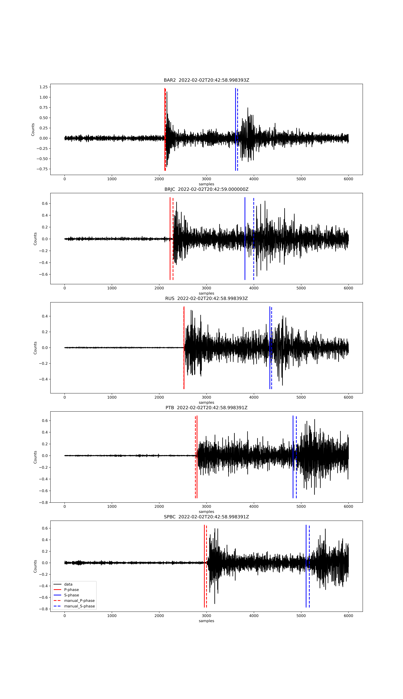

# PhaseTravelTime 
An easy way to calculate P and S seismic travel times based on 1D velocity model
<!-- .element width="700"-->

## Installation
```
conda env create -f ptt.yml
conda activate ptt

conda install -c conda-forge cython>=0.29.14' h5py numpy scipy
git clone https://github.com/malcolmw/pykonal mypath/to/pykonal
cd mypath/to/pykonal
pip install .
```

See the example.